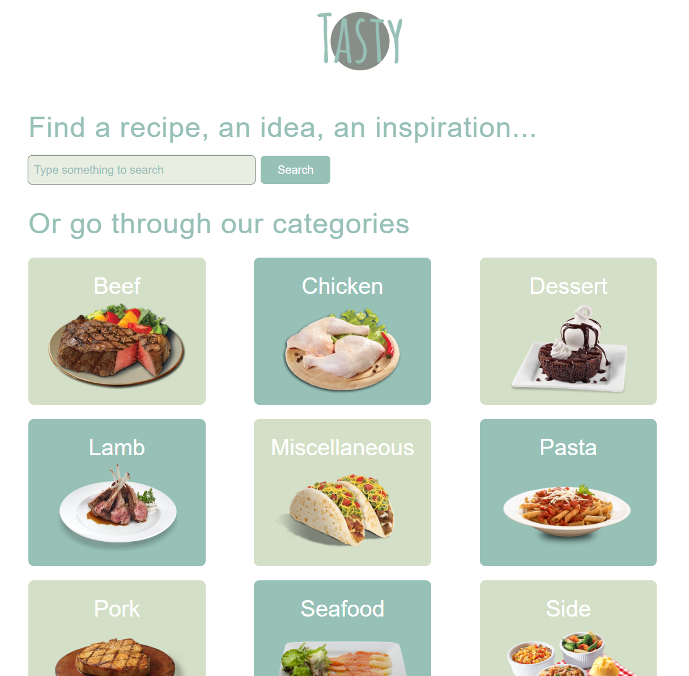
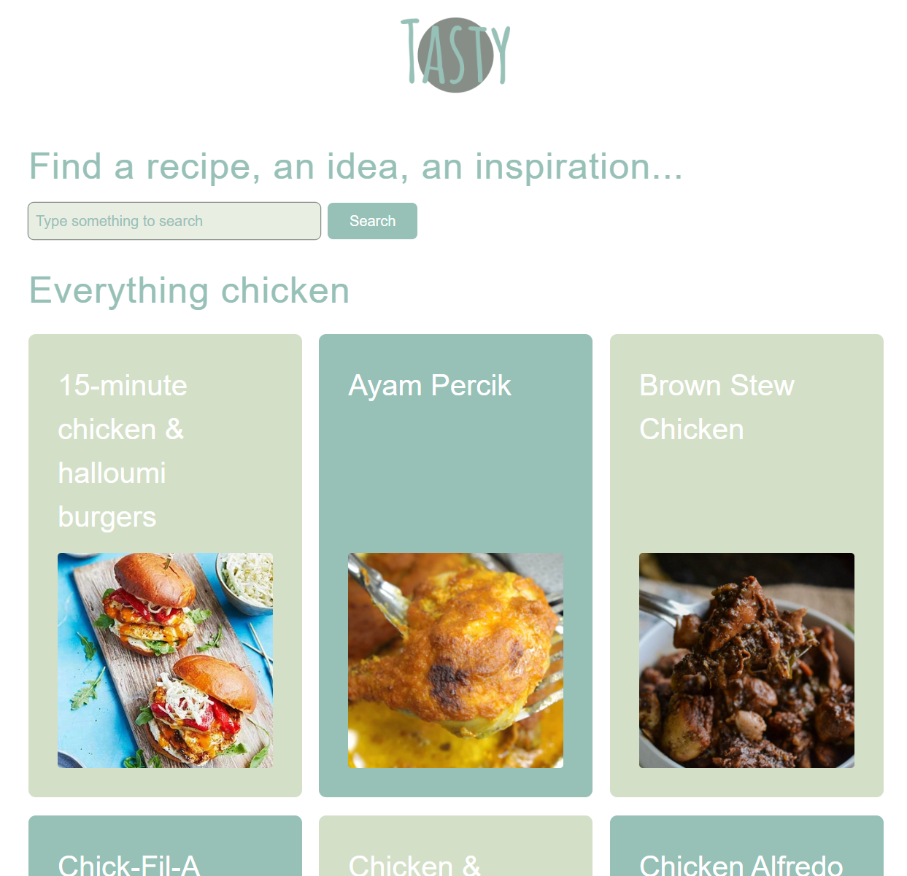
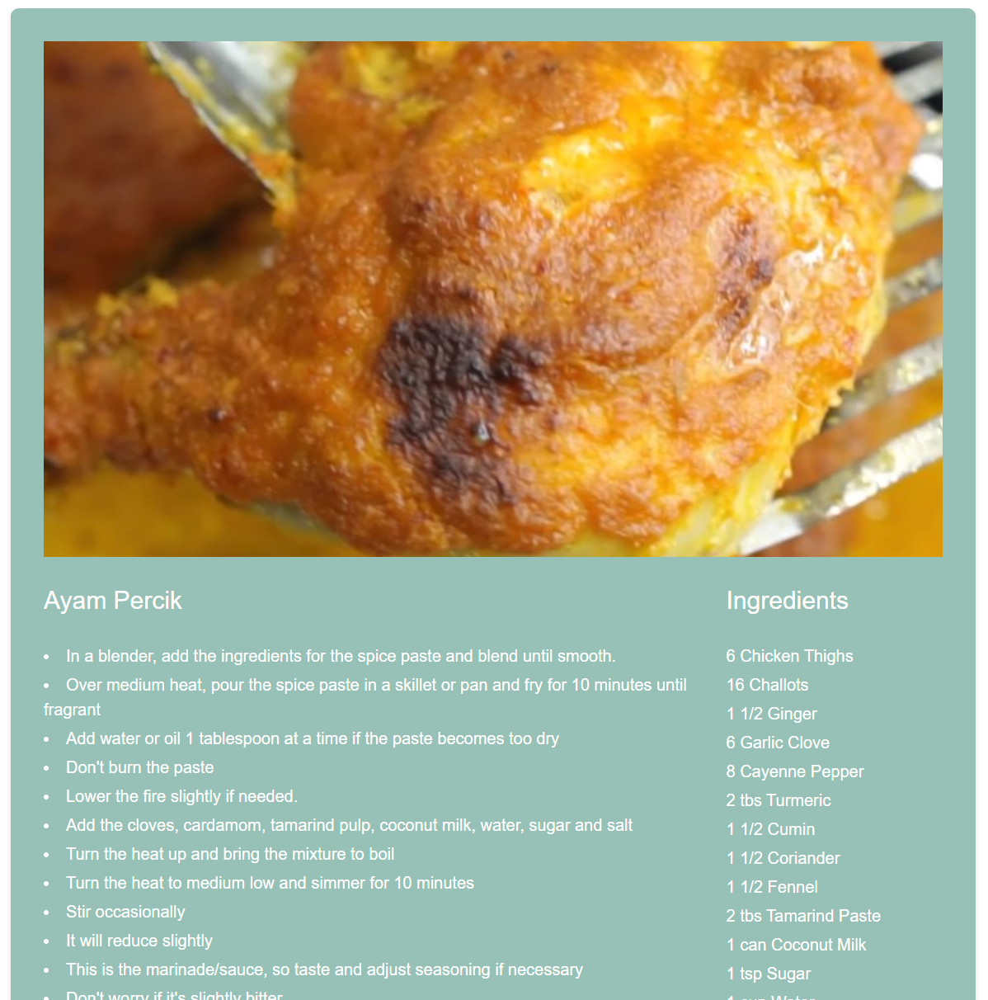
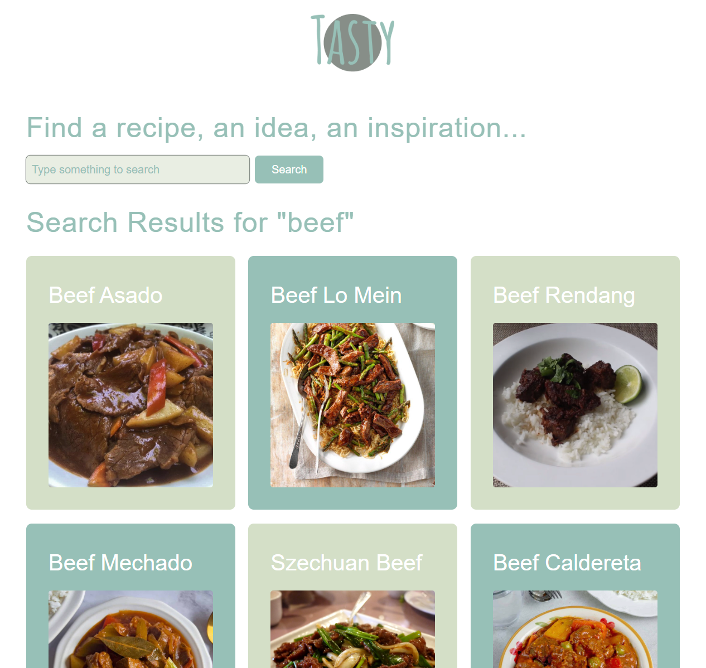

# 🍲 Projekt: Tasty V2

Diese Webanwendung ermöglicht es Benutzern, verschiedene Essenskategorien und detaillierte Rezepte zu durchsuchen sowie Gerichte nach Namen zu suchen. Das Projekt wurde im Rahmen einer Frontend-Ausbildung mit **React**, **TypeScript** und **Vite** umgesetzt.

🔗 **Live-Demo**: [tinabk-tasty-v2.netlify.app](https://tinabk-tasty-v2.netlify.app/)

## 🧰 Verwendete Technologien & Tools

-   ⚛️ **React** – Komponentenbasiertes JavaScript-Framework für die Benutzeroberfläche.
-   🟦 **TypeScript** – Typisiertes Superset von JavaScript für bessere Codequalität und Zuverlässigkeit.
-   ⚡ **Vite** – Moderner und schneller Build- und Entwicklungsserver.
-   🎨 **Tailwind CSS** – Utility-First CSS-Framework für schnelles und responsives Design.
-   🗃️ **Modulare Komponentenstruktur** – Für Wiederverwendbarkeit und Code-Klarheit.
-   🧠 **REST API ([TheMealDB API](https://www.themealdb.com/api.php))** – Zur dynamischen Datenabfrage von Kategorien und Gerichten.
-   🔠 **Google Fonts: Poppins** – Für eine moderne Typografie.
-   🧩 **Eigene Interfaces (`ICategory.ts`, `IMeal.ts`)** – Zur Definition der Datenstruktur.
-   🛠️ **VS Code**, **Git** & **GitHub** – Als Entwicklungsumgebung und zur Versionskontrolle.
-   🔄 **React Router DOM** – Für Navigation und Routing in der Single-Page-Anwendung.

## 🔧 Funktionen

### 📋 Kategorieliste anzeigen

-   Auf der Startseite werden alle verfügbaren Essenskategorien in einem Raster mit einem einzigartigen Schachbrettmuster angezeigt.
-   Beim Klick auf eine Kategorie öffnet sich die Detailansicht mit einer Liste der Gerichte dieser Kategorie.
-   Eine "Zufällig" Kategorie wurde hinzugefügt, um ein zufällig ausgewähltes Gericht anzuzeigen.

### 🔍 Gerichtssuche

-   Der Header enthält ein Suchfeld, mit dem Benutzer Gerichte nach Namen suchen können.
-   Die Suchergebnisse werden auf einer separaten Seite angezeigt.

### 🍽️ Gerichtsliste nach Kategorie/Suche

-   Zeigt eine Liste von Gerichten mit Bild und Namen an.
-   Gerichtsnamen werden auf eine bestimmte Länge gekürzt, um Überlauf zu vermeiden.
-   Beim Klick auf ein Gericht öffnet sich dessen Detailansicht.

### 📝 Gerichtsdetails

-   Zeigt detaillierte Informationen über ein ausgewähltes Gericht: Name, Beschreibung, Zutaten, Anweisungen, YouTube-Video-Link (falls vorhanden) und Quelle.
-   Anweisungen werden als Aufzählungspunkte für bessere Lesbarkeit angezeigt.

### 🌀 Lade- und Fehlerzustände

-   Während des Ladens von Daten wird ein animierter Ladeindikator angezeigt.
-   Im Falle eines Datenladefehlers wird eine Fehlermeldung angezeigt.

### 🏠 Navigation

-   "Home"-Button (Logo) zur Rückkehr zur Startseite.
-   Link zu einem zufälligen Gericht.

## Kontaktinformationen

Bei Fragen oder Anregungen können Sie mich gerne kontaktieren:

-   **E-Mail**: barshchevskak@gmail.com
-   **GitHub**: [TinaBK24](https://github.com/TinaBK24)

## Screenshots

### 🔻 Home

### 🔻 Kategorieseite (Gerichtsliste)

### 🔻 Gerichtsdetails

### 🔻 Suchergebnisseite

